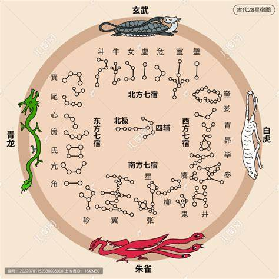

参考连接：<a href='https://www.jianshu.com/p/07766db1c6fc'>二十八星宿图与星宿详解</a>

#### 二十八星宿

&emsp;&emsp;二十八星宿一共划分为东、北、西、南四方，每一方有七宿。四方中的七宿形成动物形状，因而四方分别用四种动物相配：东方苍龙、北方玄武（龟蛇）、西方白虎、南方朱雀，由以上七宿组成的四个动物的形象，合称为四象、四维、四兽。
&emsp;&emsp;二十八星宿具体组成如下

> 东方青龙：角、亢、氐（di:4）、房、心、尾、箕（ji:4）
> 北方玄武：斗（dou:3）、牛、女、虚、危、室、壁
> 西方白虎：娄（lou:2）、胃、昴（mao:3）、毕、觜（zi:4）、参（shen:1）
> 南方朱雀：井、鬼、柳、星、张、翼、轸（zhen:3)

#### 星宿与七曜

&emsp;&emsp;七曜，又称七政、七纬、七耀等，是古代中国人将 荧惑星（火星）、辰星（水星）、岁星（木星）、太白星（金星）、镇星（土星）称为五星，五星又称五曜，加上太阳星（日）、太阴星（月），合称七曜。
<table>
    <tbody>
        <tr>
            <td colspan='2'>星期</td>
            <td>四</td>
            <td>五</td>
            <td>六</td>
            <td>日</td>
            <td>一</td>
            <td>二</td>
            <td>三</td>
        </tr>
        <tr>
            <td colspan='2'>七曜</td>
            <td>木</td>
            <td>金</td>
            <td>土</td>
            <td>日</td>
            <td>月</td>
            <td>火</td>
            <td>水</td>
        </tr>
        <tr>
            <td rowspan='4' id='chuizhi'>二十八星宿</td>
            <td>东方苍龙</td>
            <td>角</td>
            <td>亢</td>
            <td>氐</td>
            <td>房</td>
            <td>心</td>
            <td>尾</td>
            <td>箕</td>
        </tr>
        <tr>
            <td>北方玄武</td>
            <td>斗</td>
            <td>牛</td>
            <td>女</td>
            <td>虚</td>
            <td>危</td>
            <td>室</td>
            <td>壁</td>
        </tr>
        <tr>
          <td>西方白虎</td>
            <td>奎</td>
            <td>娄</td>
            <td>胃</td>
            <td>昴</td>
            <td>毕</td>
            <td>觜</td>
            <td>参</td>
        </tr>
        <tr>
          <td>南方朱雀</td>
            <td>井</td>
            <td>鬼</td>
            <td>柳</td>
            <td>星</td>
            <td>张</td>
            <td>翼</td>
            <td>轸</td>
        </tr>
    </tbody>
</table>

#### 星宿动物

<strong>古人面向南方看方向节气，所以才有左东方青龙、右西方白虎、后北方玄武、前南方朱雀的说法。二十八宿从角宿开始，自西向东排列，与日、月视运动的方向相反:</strong>

> 东方称青龙:角木蛟、亢金龙、氐土貉、房日兔、心月狐、尾火虎、箕水豹;
> 北方称玄武:斗木獬、牛金牛、女土蝠、虚日鼠、危月燕、室火猪、壁水貐;
> 西方称白虎:奎木狼、娄金狗、胃土雉、昴日鸡、毕月乌、觜火猴、参水猿;
> 南方称朱雀:井木犴、鬼金羊、柳土獐、星日马、张月鹿、翼火蛇、轸水蚓。

详细图片参考连接：<a href ='https://www.zcool.com.cn/work/ZNTQ0NDgzMDg=.html'>二十八星宿全集</a>

#### 二十八星宿在人间的职能

1. 东方青龙：
> 角木蛟：主管人间将军、兵甲、雨泽、延生、农田耕稼之司。
> 亢金龙：主管人间瘟灾、大风、飚石、百药、国师、三公、五老百官禄秩之司。
> 氐土貉：主管人间后妃官府、山林草木、雨水淫溢之司。
> 房日兔：主管人间藏内、宝器金玉、管O惊风、骇雨负重、擎骆之司。
> 心月狐：主管人间帝王明堂、雨泽、工役技艺百巧之司。
> 尾火虎：主管人间祥云瑞雾、女人不和之司。
> 箕水豹：主管人间斜风细雨、奸邪淫佞妄、蛮夷狐貉、虏狄津梁水族之司。

2. 西方白虎
> 奎木狼：主管人间武库兵甲戈矛、沟渎池庭、风雨雷电之司。
> 娄金狗：主管人间宫观寺院禁苑内庭、供给牺牲、郊礼斋醮之司。
> 胃土雉：主管人间仓库、积聚金银珍宝疋帛、雷公五谷之司。
> 昴日鸡：主管人间天地晴明、去衰除祸、狱典曹吏、刑罚囚系考决之司。
> 毕月乌：主管人间天地开泰、朱轮宝盖、边兵守境封疆安宁之司。
> 觜火猴：主管人间收敛万物、风雷雨泽、山川房庙、鬼魅妖怪之司。
> 参水猿：主管人间将军权衡境域、杀伐冤仇、劫夺忿悦之司。

3. 南方朱雀
> 井木犴：主管人间天色昏暗、池塘坡井、桥梁大水江湖、鱼龙介族之司。
> 鬼金羊：主管人间金玉疋帛、丧祸诅咒、毒药、司察奸恶之司。
> 柳土獐：主管人间庖厨食味、天色昏黄、雷雨、兵戈草贼之司。
> 星日马：主管人间裁缝、衣装文绣、晴明、刀剑血光之司。
> 张月鹿：主管人间宗庙、珍宝衣服、赐宴宾容、父子不睦、兄弟不和之司。
> 翼火蛇：主管人间乐府五音六律、水府鱼龙、飞走群毛万类之司。
> 轸水蚓：主管人间天地明朗、哭泣离别、官府口舌、凶恶危难之司。

4. 北方玄武
> 斗木獬：主管人间进士登科爵禄、微风细雨、斛斗升合秤尺之司。
> 牛金牛：主管人间云雾霜雪、牛羊六畜牺牲、足虫百兽、南越百蛮之司。
> 女土蝠：主管人间裁缝衣物、嫁娶聘偶、阴凝大风之司。
> 虚日鼠：主管人间宫室庙堂盖屋、祭礼考妣、五虚六耗、悲泣之司。
> 危月燕：主管人间丘陵坟墓悲泣、旋风沙石、危厄艰险之司。
> 室火猪：主管人间官室金户玉堂、文章图籍、军料府库、阴霾凝滞之司。
> 壁水貐：主管人间文章图书秘府、阴寒雨泽霹雳，五谷百果之司。

#### 附录：星宿解说
##### 东方七宿

> &emsp;&emsp;角宿诚恳合谐，福缘深厚，平易近人不拘小节，有丰富的人生经历，擅长决策，有条不紊。若是太过自我，容易自寻烦恼，而刚愎自用。
亢宿精明决策，具有说服力，计划欠周详，容易意气用事，有斗志但运程有反复，脾气容易冲动。常因高傲和爱慕虚荣而出现损失。
> &emsp;&emsp;氐宿善解人意，易得别人帮助，善于谋略，八面玲珑具有野心，行动果决也不失斯文和气。常因不愿受束缚而显得游荡。
> &emsp;&emsp;房宿生来幸运，具有财气，需要脚踏实地，不然爬的高摔的疼，要保持低调，以免引起妒嫉。戒骄戒躁，这能够在事业上有所成就。
> &emsp;&emsp;心宿坚毅勤奋，忌恶扬善，不怕吃苦，积极具有正义感，属于能者多劳。不足的地方是疑心过重，有时会妨碍才能的发挥与事业的发展。
> &emsp;&emsp;尾宿个性严肃，能干谨慎，喜欢竞争，要注意修养和内涵，才能够成就财富。要注意的地方:外泠内热，容易弄巧成拙，带来相反的效果。
> &emsp;&emsp;箕宿具智慧和才干，不畏权威，无拘无束的享受主义者，遇到挫折也不会悲观。若是思想过于开放，在现今的社会，能够促使家庭观念淡薄，这是应该注意的地方。

##### 北方七宿

> &emsp;&emsp;斗宿遇强则强，遇弱则弱，情绪变化较大，具有突破逆境的力量，富有创造力。个性深藏不露，容易招人误会，需要一颗安定的心。
> &emsp;&emsp;牛宿自尊心强，好争强，不服输，面对强的竞争对手，更有劲，有才华，不会耍心机手段，是个踏实、埋头苦干，按部就班办事的人，平时不会表明心意。
> &emsp;&emsp;女宿乐于助人，适合学习专门的技能，思考敏捷，为了自己的信念会努力奋斗。挫败的原因，常因个性刚强，不懂情调，或者是太坦白了。
> &emsp;&emsp;虚宿富贵天生，人缘好，具有坚韧的耐力，对玄学有兴趣，好奇心重。但由于主观强爱争执，而令自己的精神受压抑。
> &emsp;&emsp;危宿脾气容易急躁，性情刚硬，本性善良而无心机，容易在人际关系上吃亏。好坏两个极端，比较明显，因为本身具有实力，要看把握的方向了。
> &emsp;&emsp;室宿威武刚烈，具有斗志和竞争心，积极乐观，欲望强烈。缺点是断臂独行，轻率急躁，需慎重思考，懂得温柔，过分的豪放会带来失败。
> &emsp;&emsp;壁宿内向冷静，心思甚密，处事周详，容意得到上司信任，但人缘运欠佳。固执和孤僻，会使原有的正义感，而不被别人理解，最好远离是非地，避免口舌。

##### 西方七宿

> &emsp;&emsp;奎宿感情丰富，耿直而友善热情，追求真善美，人生必较幸运。欠缺胆识和耐力，只要放下固执，幸福就在身边了。
> &emsp;&emsp;娄宿思想敏捷，办事效率高，精力充沛，求知欲强，乐于助人。有任性和反叛的潜意识，若露出冷酷的一面，就增强了个人主意的色彩。
> &emsp;&emsp;胃宿刚强不屈，凭借不屈不挠的精神可以平步青云，但也因为冷酷无情，造成起落较大的人生。努力搞好人际关系，才更具有竞争力。
> &emsp;&emsp;昴宿宽厚慈和，勤奋好学，能言善辩，刚柔并济。但是欠缺风趣，内在的个性强烈，能力越是出众，越应该谦虚待人。
> &emsp;&emsp;毕宿坚毅稳重，安详和谐，必较理想主义，有财气懂得计划。要注意提高自己的应变能力，作事有始有终，才不被别人认为眼高手底。
> &emsp;&emsp;觜宿言行谨慎，注重原则，善于表达，不喜欢暴力，心地善良充满爱心。缺陷在，过度自信容易树敌，因人缘受制而有失败。
> &emsp;&emsp;参宿有才干守信用，临危不乱，欠缺耐性，容易冲动，带有反叛或者心浮的意味。若是忍不住别人的批评和指责，就会造成孤立的局面。

##### 南方七宿

> &emsp;&emsp;井宿重感情，风趣幽默，本性忠厚，属于性情中人，有双重的性格，开朗和沉稳。只是有时因为自尊心过强，不懂变通。
> &emsp;&emsp;鬼宿平易近人，正义凛然，容易受到欢迎，感情丰富，一生的变化大。很快地能将不愉快的事情忘记，讨厌受到束缚，耐力不足容易失去良机。
> &emsp;&emsp;柳宿善恶分明，个性强烈，一旦动怒不可收拾，要谨慎由于冲动而受骗。表面温柔随和，内在心高气傲，常以自我为中心的话，会造成离群而孤立。
> &emsp;&emsp;星宿天资聪敏，刻苦耐劳，向往自由变化不定，属于大器晚成的类型。由于个性高，不爱巴结讨好奉承，容易造成人缘较差，影响才能的发挥。
> &emsp;&emsp;张宿懂得讨人喜欢，有计谋，重视安逸的生活，喜欢研究学问。若是固持好胜，一生则波折不断，具有成功的条件，还要把握机会才行。
> &emsp;&emsp;翼宿具有艺术气质，不喜欢竞争，陶醉在自我的世界，通常在外地发展有收获。由于主观强，言词尖锐，容易引起是非或者误会。
> &emsp;&emsp;轸宿思想敏捷，适应能力强，稳重有内涵，喜欢深藏不露，可成大事。由于处世较低调，所以适合位居幕后，或者从事决策性的工作更为适宜。

#### 附录：二十八宿值日占风雨阴晴歌诀

##### 春季

虚危室壁多风雨，若遇奎星天色晴，

娄胃乌风天冷冻，昴毕温和天又明，

轸角二星天少雨，或起风云傍岭行，

亢宿大风起沙石，氐房心尾雨风声，

箕斗蒙蒙天少雨，牛女微微作雨声。

##### 夏季

虚危室壁天半阴，奎娄胃宿雨冥冥，

昴毕二宿天有雨，觜参二宿天又阴，

井鬼柳星晴或雨，张星翼轸又晴明，

角亢二星太阳见，氐房二宿大雨风，

心尾依然宿作雨，箕斗牛女遇天晴。

##### 秋季

虚危室壁震雷惊，奎娄胃昴雨霖庭，

毕觜参井晴又雨，鬼柳云开客便行，

星张翼轸天无雨，角亢二星风雨声，

氐房心尾必有雨，箕斗牛女雨蒙蒙。

##### 冬季

虚危室壁多风雨，若遇奎星天色晴，

娄胃雨声天冷冻，昴毕之期天又晴，

觜参二宿坐时晴，井鬼二星天色黄，

莫道柳星云霹起，天寒风雨有严霜，

张翼风雨又见日，轸角夜雨日还晴，

亢宿大风起沙石，氐房心尾雨风声，

箕斗二星天有雨，牛女阴凝天又晴，

占卜阴晴真妙诀，仙贤秘密不虚名，

掌上轮星天上应，定就乾坤阴与晴。

#### 附录：二十八正曜

&emsp;&emsp;中国古代曾列出二十八“主星”，这里的“主星”也称“正曜”，即为“二十八正曜”，具体各“正曜”为：紫微、天机、太阳、武曲、天同、廉贞、天府、太阴、贪狼、巨门、天相、天梁、七杀、破军、禄存、天马、左辅、右弼、文昌、文曲、天魁、天钺、火星、铃星、擎羊、陀罗、天空、地劫。

